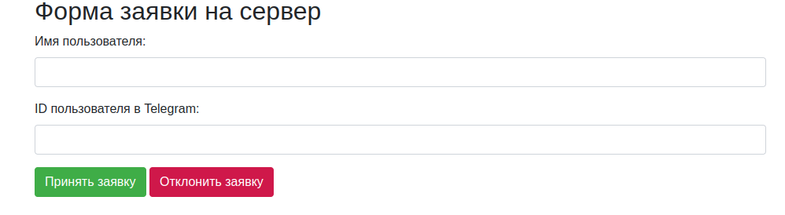
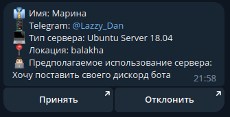

# PHP-form-Telegram

## О проекте

В этот скрипт входит: 
* Страница заказа сервера 
* Страница отклонения и принятия заказа.

И так, как работает этот скрипт ?
* Пользователь заполняет форму, заказывает сервер, в этом случае он бесплатный. Вам приходит сообщение с содержанием заказа:

Of course, no one template will serve all projects since your needs may be different. So I'll be adding more in the near future. You may also suggest changes by forking this repo and creating a pull request or opening an issue. Thanks to all the people have contributed to expanding this template!
