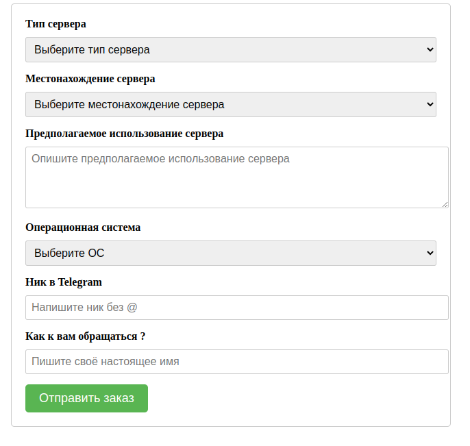

# PHP-form-Telegram


## В этот скрипт входит: 

* Страница заказа сервера:



* Страница отклонения и принятия заказа.


И так, как работает этот скрипт ?
* Пользователь заполняет форму, заказывает сервер, в этом случае он бесплатный. Вам приходит сообщение с содержанием заказа:


* Если вы согласны и готовы создать этому человеку сервер, то можете написать ему самому лично, ибо же если вас несколько человек можете использовать страницу принятия и отказа заказа.

```sh
  https://site.com/senter
  ```
